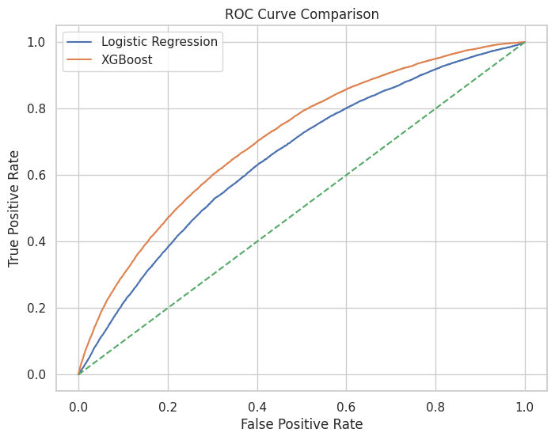
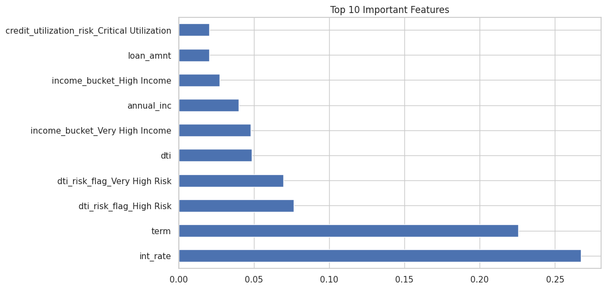
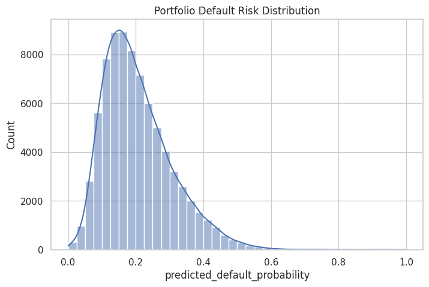
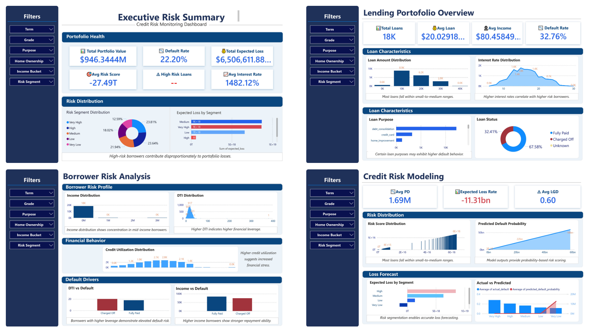

# Credit Risk Analytics: Loan Default Prediction & Risk Monitoring

An end-to-end **credit risk analytics project** that analyzes borrower financial data, predicts loan default risk, segments borrowers by risk level, estimates potential credit losses, and presents portfolio insights through an interactive Power BI dashboard.

---

## 📌 Project Overview

Credit risk is one of the most important areas of banking and financial services. Lending institutions need to identify potentially high-risk borrowers, estimate the likelihood of default, and monitor their overall loan portfolio exposure.

This project simulates a **banking credit risk analytics workflow**, combining:

* Data cleaning and exploratory analysis
* Feature engineering
* Machine learning
* Credit risk scoring
* Expected loss estimation
* Interactive Power BI visualization

The objective is to transform raw borrower-level data into **actionable insights for credit risk monitoring and decision-making**.

---

## 🎯 Business Problem

Loan defaults can result in significant financial losses for banks and lending institutions.

A credit risk analytics system should help answer questions such as:

* Which borrowers are more likely to default?
* What financial characteristics are associated with higher risk?
* How can borrowers be segmented according to their risk?
* What is the potential financial exposure from risky loans?
* Which areas of the loan portfolio require closer monitoring?

This project addresses these questions through a combination of **predictive analytics and financial risk modeling**.

---

## 📊 Dataset

The dataset contains borrower-level financial and loan-related information, including:

### Loan Information

* Loan amount
* Loan term
* Interest rate
* Loan characteristics

### Borrower Financial Profile

* Annual income
* Debt-to-income ratio (DTI)
* Employment information
* Financial indicators

### Credit Behaviour

* Credit utilization
* Number of accounts
* Credit-related characteristics

These variables are used to analyze borrower behavior and build a loan default prediction model.

---

## 🔄 Project Workflow

```text
Raw Loan Data
      ↓
Data Cleaning & Preprocessing
      ↓
Exploratory Data Analysis
      ↓
Feature Engineering
      ↓
Machine Learning Model
      ↓
Default Probability Prediction
      ↓
Risk Score Generation
      ↓
Borrower Risk Segmentation
      ↓
Expected Loss Estimation
      ↓
Power BI Risk Dashboard
```

---

## ⚙️ Feature Engineering

Several additional risk indicators were created to improve the analysis and make the results easier to interpret.

| Feature                 | Purpose                                            |
| ----------------------- | -------------------------------------------------- |
| DTI Risk Flag           | Identifies borrowers with relatively high leverage |
| Income Bucket           | Groups borrowers according to income levels        |
| Credit Utilization Risk | Captures potential credit stress                   |
| Employment Score        | Represents employment/income stability             |
| Loan Size Category      | Segments loans based on exposure                   |

Feature engineering helps convert raw financial variables into **business-oriented risk indicators**.

---

## 🤖 Machine Learning Model

A classification model is used to estimate the **probability of loan default**.

### Model Outputs

* Probability of Default (PD)
* Borrower Risk Score
* Risk Category
* Default / Non-default prediction

The resulting risk scores can be used to identify borrowers requiring **additional monitoring or risk assessment**.

---

## 💰 Credit Risk Metrics

The project incorporates commonly used credit risk concepts.

### Probability of Default (PD)

The estimated likelihood that a borrower will default on a loan.

### Loss Given Default (LGD)

The percentage of exposure expected to be lost if a borrower defaults.

### Exposure at Default (EAD)

The amount of financial exposure outstanding when a default occurs.

### Expected Loss (EL)

The project uses:

**Expected Loss = PD × LGD × EAD**

Expected loss provides an estimate of potential credit losses and helps demonstrate how predictive risk scores can be translated into **financial exposure estimates**.

---

## 📈 Key Insights

The analysis focuses on identifying relationships between borrower characteristics and default risk.

Key areas analyzed include:

* Relationship between **Debt-to-Income ratio and default risk**
* Impact of **credit utilization** on borrower risk
* Differences in risk across **income segments**
* Relationship between **loan characteristics and default**
* Distribution of borrowers across different risk categories
* Portfolio-level expected credit exposure

These insights demonstrate how data analytics can support **credit risk monitoring and lending decisions**.

---

# 📊 Model Visualizations

## ROC Curve — Model Performance

The ROC curve evaluates the model's ability to distinguish between borrowers who default and those who do not.

The **AUC (Area Under the Curve)** provides a measure of the model's classification performance.



---

## Feature Importance — Key Risk Drivers

Feature importance analysis helps identify the variables that contribute most strongly to the model's predictions.

Important risk drivers analyzed include:

* Debt-to-Income Ratio
* Credit Utilization
* Loan Amount
* Interest Rate
* Borrower Income



---

## Risk Score Distribution

The risk-score distribution shows how borrowers are distributed across different levels of predicted credit risk.

This helps with:

* Identifying higher-risk borrower segments
* Monitoring portfolio composition
* Prioritizing borrowers for further review



---

# 📊 Power BI Dashboard

An interactive **Credit Risk Monitoring Dashboard** was developed in Power BI to convert the analytical results into an easy-to-understand business intelligence interface.

## Dashboard Preview



### Dashboard Features

* Portfolio risk overview
* Total loan exposure
* Default-rate analysis
* Borrower risk segmentation
* Probability of default analysis
* Expected loss monitoring
* Risk-category distribution
* Interactive filters and drill-downs

The dashboard allows users to explore portfolio risk from both **high-level and borrower-segment perspectives**.

---

# 🛠️ Tools & Technologies

### Programming & Data Analysis

* Python
* Pandas
* NumPy

### Machine Learning

* Scikit-learn

### Data Visualization

* Matplotlib
* Seaborn

### Business Intelligence

* Power BI

### Other

* Git
* GitHub

---

# 📁 Project Structure

```text
Credit-Risk-Analytics-Loan-Default-Prediction/
│
├── data/
│   └── loan_data.csv
│
├── notebooks/
│   └── credit_risk_analysis.ipynb
│
├── images/
│   ├── roc_curve.png
│   ├── feature_importance.png
│   └── risk_distribution.png
│
├── dashboard_preview.png
├── README.md
└── requirements.txt
```

---

# 🚀 Key Skills Demonstrated

This project demonstrates practical experience in:

* Credit Risk Analytics
* Financial Data Analysis
* Data Cleaning
* Exploratory Data Analysis
* Feature Engineering
* Machine Learning
* Risk Segmentation
* Probability of Default Modeling
* Expected Loss Analysis
* Power BI Dashboard Development
* Business Intelligence
* Data-driven Decision Making

---

# 🎯 Business Value

The project demonstrates how a financial institution can move from **raw borrower data → predictive risk analysis → financial exposure estimation → interactive risk monitoring**.

The workflow can support areas such as:

* Credit assessment
* Portfolio monitoring
* Risk segmentation
* Early identification of potentially risky borrowers
* Credit-loss estimation
* Data-driven lending decisions

---

# 👤 Author

**Ashutosh k Verma**

B.Tech — Metallurgy & Materials Science
NIT Durgapur

Interested in:

* Banking & Financial Analytics
* Credit Risk
* Data Analytics
* Machine Learning
* Business Intelligence

---

## ⭐ Project Summary

**Credit Risk Analytics: Loan Default Prediction & Risk Monitoring** demonstrates an end-to-end approach to analyzing credit risk using **Python, machine learning, financial risk metrics, and Power BI**.

The project transforms borrower-level financial data into **risk scores, borrower segments, potential loss estimates, and portfolio-level insights**, providing a practical simulation of credit risk analytics in the banking domain.
